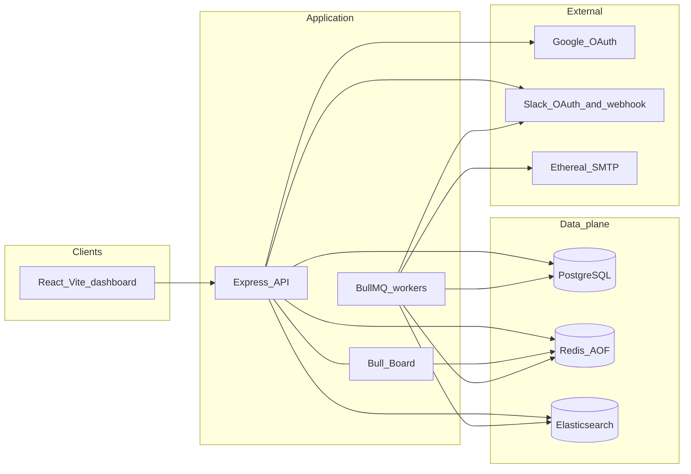
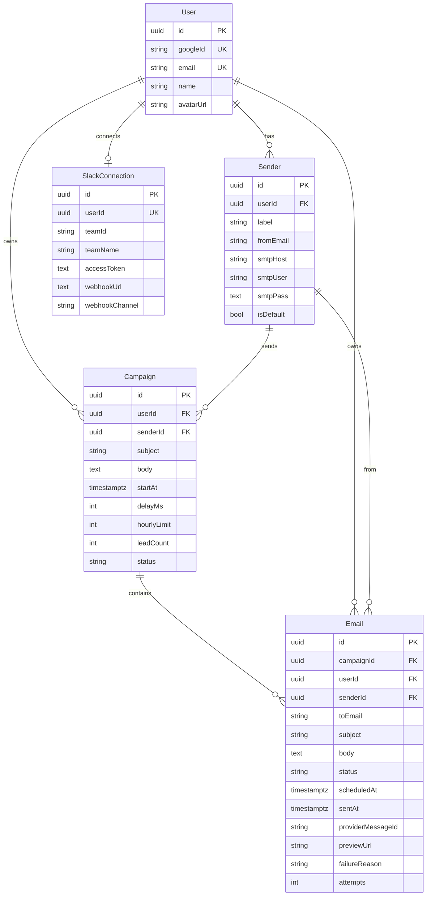
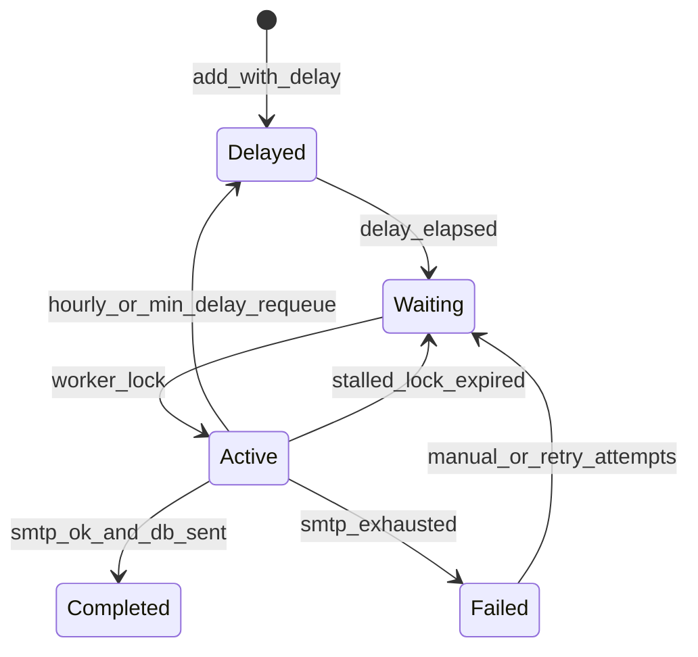

# Email Scheduler Technical Blueprint

## Current repository state

This is a **greenfield** repo. Inspected contents:

- [README.md](README.md) — one-line stub
- [OutboxLabsAssignment.md](OutboxLabsAssignment.md) — source of truth (untracked)
- Git: initial commit `27939cc`, remote `https://github.com/amriteshx1/reachinbox-email-scheduler.git`
- No `package.json`, Docker files, source, tests, or conventions to inherit

The Figma file ([Outbox Labs Assignment](https://www.figma.com/design/kOTwGlESjijCYnMgtHfvfU/Outbox-Labs-Assignment?node-id=59-4050)) could not be rendered in this pass (WebGL). Phase 3 starts by walking the Figma frames and matching layout/tokens; product behavior below comes from the assignment markdown.

---

## Recommended architecture and service boundaries

**Two deployable Node processes, one shared data plane.**



| Process | Responsibility | Why split |
|---|---|---|
| **API** | Auth, CRUD, campaign enqueue, search, Slack/Google OAuth, Bull Board | HTTP latency stays independent of SMTP |
| **Worker** | Consume delayed jobs, SMTP, rate-limit, Slack notify, ES index | Can scale horizontally; crash of HTTP does not stall sends |

Locally, a single process can start both (`WORKER_ENABLED=true`) for DX. Docker Compose runs `api` and `worker` as **the same image, different command**, proving multi-instance safety.

**Why not Next.js API routes / a custom Redis scheduler / node-cron:** Express is required; BullMQ delayed jobs already persist run-at timestamps in Redis (this is the no-cron requirement); a custom scanner would reinvent BullMQ and invite accidental cron.

**Why PostgreSQL + Prisma, not MySQL/Knex:** timestamptz, JSON, and row-level locking map cleanly to the status machine; Prisma gives typed models and migrations reviewers can read. Trade-off: Prisma is heavier than Drizzle; acceptable for this assignment.

**Why Vite + React, not Next.js:** the backend must be Express. A separate Vite SPA avoids mixing Next route handlers with the required Express app and keeps cookie CORS explicit.

**Canonical state vs operational state:**

- **PostgreSQL** is canonical: users, campaigns, emails, senders, Slack installs, send outcomes
- **Redis** is operational: BullMQ job state, distributed rate-limit counters, inter-send locks, sessions
- **Elasticsearch** is a derived search index, never the source of truth

---

## Repository / folder structure

npm workspaces (no extra package manager).

```text
/
  package.json                 # workspaces: backend, frontend
  docker-compose.yml           # postgres, redis (AOF), elasticsearch
  .env.example
  README.md
  backend/
    package.json
    prisma/schema.prisma
    prisma/migrations/
    src/
      index.ts                 # API process
      worker.ts                # Worker process
      config/env.ts            # zod-validated env
      lib/{prisma,redis,es,logger,mailer}.ts
      queues/{emailSend,searchIndex,slackNotify}.ts
      workers/{emailSend,searchIndex,slackNotify}.ts
      services/{scheduler,rateLimiter,slotAllocator,emailSend,slack,search,idempotency}.ts
      routes/{auth,campaigns,emails,senders,slack,health}.ts
      middleware/{requireAuth,errorHandler,validate}.ts
      jobs/reconcileScheduled.ts  # boot-only, not a loop
      types/
    tests/
  frontend/
    package.json
    src/
      app/                     # router, providers
      pages/{Login,Dashboard}
      features/{auth,compose,emails,slack}
      components/ui/           # Button, Input, Table, Modal, Toast, Empty, Spinner
      lib/api.ts
      types/
```

---

## PostgreSQL data model



**Email status machine:** `scheduled` → `sending` → `sent` | `failed`

- Unique `(campaignId, toEmail)` prevents duplicate leads in one upload
- Unique `Email.id` is the BullMQ `jobId` suffix (`send:${emailId}`)
- Indexes: `(userId, status, scheduledAt)`, `(userId, status, sentAt)`, `(senderId, scheduledAt)`
- `Campaign.status`: `scheduled` | `sending` | `completed` | `failed` (derived from child emails; update on worker completion)

**Slack:** one connection per user (assignment is per-user/tenant). Disconnect deletes the row. Reconnect upserts.

**Senders:** each row is a persisted Ethereal account (host/port/user/pass). Creating accounts only in-memory would lose the inbox across restarts.

---

## Redis / BullMQ architecture (no cron)

### Queues

| Queue | Job | Delay | Retries | Purpose |
|---|---|---|---|---|
| `email-send` | `send` | Yes — `delay = scheduledAt - now` | SMTP only (e.g. 5, exp backoff) | Actual send |
| `search-index` | `upsert` / `delete` | No | Aggressive (e.g. 10) | ES sync |
| `slack-notify` | `rate-limit` | No | 3 | Slack side-effect isolated from SMTP |

Bull Board mounts all three at `/admin/queues`.

### Why this satisfies **no-cron**

Scheduling is `queue.add('send', data, { jobId, delay, removeOnComplete, removeOnFail })`. BullMQ stores delayed jobs in a Redis sorted set keyed by timestamp. **Workers promote due jobs internally.** There is no OS crontab, no `node-cron`, no “every minute scan the DB” loop.

`QueueScheduler` is obsolete (BullMQ 2+); workers themselves promote delayed jobs. Restarting Node does **not** require re-creating timers: Redis still holds the ZSET.

**Boot reconcile is not cron:** on worker start only, load `Email` rows with `status=scheduled` and `scheduledAt` in the future (and in-past-but-unsent), and `queue.add` with the same `jobId`. BullMQ ignores duplicate job IDs. This heals Redis AOF loss. It must **not** run on an interval.

### Job lifecycle (`email-send`)



1. API inserts `Email(status=scheduled, scheduledAt=T)` then `addBulk` delayed jobs (`jobId = send:${email.id}`).
2. At `T`, job becomes waiting, then active (concurrency-limited).
3. Worker: load row → idempotency gate → min-delay + hourly reserve (Redis Lua) → CAS `scheduled→sending` → SMTP → persist `sent` + `providerMessageId` + `previewUrl` → enqueue `search-index` → complete.
4. If hourly/min-delay blocks: **do not fail**. `job.moveToDelayed(nextSlot, token)` + `throw DelayedError()`. `attemptsMade` does not increment. Update `email.scheduledAt`.
5. SMTP errors: throw normal `Error` so BullMQ retries with backoff; after max attempts, `status=failed`.
6. `removeOnComplete: { count: 200 }`, `removeOnFail: { count: 1000 }` so Bull Board stays useful without unbounded Redis.

### Worker settings

- `concurrency`: `WORKER_CONCURRENCY` (default `5`)
- `limiter`: **not** used as the hourly cap (global limiter would serialize *all* senders). Optional mild global limiter only if we want a cluster-wide SMTP niceness cap; primary spacing is custom Redis (below).
- `lockDuration`: 30s (SMTP is short); `maxStalledCount`: 2
- ioredis: `maxRetriesPerRequest: null` (BullMQ requirement)
- Graceful shutdown: `worker.close()` on `SIGINT`/`SIGTERM` before `server.close()`

---

## Exact send flow (schedule → success/fail)

1. Authenticated `POST /api/campaigns` with subject, body, start time, delay, hourly limit, sender, CSV.
2. Validate; parse leads; reject empty/invalid.
3. **Slot allocator** (Redis Lua + per-sender lock) assigns each lead a `scheduledAt` honoring:
   - campaign `startAt`
   - `max(campaign.delayMs, MIN_INTER_EMAIL_MS)`
   - `min(campaign.hourlyLimit, MAX_EMAILS_PER_HOUR_PER_SENDER)`
   - global `MAX_EMAILS_PER_HOUR`
   - already-reserved slots for that sender (existing scheduled/sending emails)
4. Transaction: insert `Campaign` + `Email` rows.
5. `emailSendQueue.addBulk(...)` with per-job `delay`.
6. Enqueue `search-index` upserts for the new scheduled emails.
7. Worker fires at `scheduledAt` (see lifecycle).
8. UI reads Postgres (`GET /api/emails?status=`) and search (`GET /api/emails/search?q=` via ES).

---

## Concurrency and minimum inter-email delay

**Two layers:**

1. **Admission stagger** — jobs are not all delayed to the same millisecond. 1000 leads at 14:00 with 2s delay become 14:00:00, 14:00:02, …
2. **Runtime Redis mutex** — Lua `reserveMinDelay(senderId, now, minDelayMs)`:
   - If `now - lastSendAt < minDelay`, return wait ms
   - Else set `lastSendAt = now` and allow
   - Worker then `moveToDelayed` if wait &gt; 0

**Why not only BullMQ `limiter: { max: 1, duration: 2000 }`?** That limiter is **queue-global across all workers** (good for multi-instance) but **not per-sender**. Multiple senders would be forced to share one 2s slot. Custom per-sender Redis keys allow sender A and B to send in parallel while each is throttled.

Default documented in README: **min 2 seconds between sends per sender** (`MIN_INTER_EMAIL_MS=2000`). Campaign delay can only be **stricter**, not looser, than this floor.

Worker concurrency is safe because: BullMQ job locks, per-email CAS, per-sender Lua (atomic), unique job IDs.

---

## Distributed hourly rate limiting

**Fixed hour windows** (UTC), Redis keys:

- `rl:sender:{senderId}:{YYYYMMDDHH}`
- `rl:global:{YYYYMMDDHH}`

Lua `tryReserveHour(senderId, senderLimit, globalLimit)`:

1. `INCR` both keys; `EXPIRE` ~2h on first increment
2. If either count **exceeds** limit: `DECR` both, return `{ ok:false, retryAt }`
3. Else `{ ok:true }` (this send is in-flight against quota)

Quota is **in-flight + sent**, not “completed only”, so 5 concurrent workers cannot slip past 200.

On SMTP failure: `DECR` so a hard fail does not burn the hour. On success: leave the increment.

**When the limit is hit (do not drop):**

Lua `reserveNextSlot(...)` finds the earliest future hour where `count < limit` (both sender and global), `INCR` that future bucket (so the slot is owned, not contended), returns `scheduledAt = hourStart + (bucketIndex * delayMs)` clamped to the hour.

Worker:

- Updates `emails.scheduled_at`
- `moveToDelayed(scheduledAt)`
- Enqueues `slack-notify` **only when the increment that just failed was exactly `limit+1` / first reject in that window** — implemented as `SET slack:rl:{userId}:{senderId}:{hour} NX EX 7200` so one Slack message per sender per hour even with many workers.

**Order:** per-sender FIFO. The allocator cursor + future-bucket `INCR` assigns later jobs later timestamps. Cross-sender order is intentionally **not** strict (parallel senders are the point).

**BullMQ limiter vs Redis counters:** Redis counters are the hourly mechanism because they are per-sender, per-hour, shared across instances, and support “spill to next hour” without failing jobs. README will state this trade-off explicitly.

---

## Idempotency and duplicate-send prevention

BullMQ is **at-least-once**. Exactly-once SMTP is approximated:

| Guard | Crash it covers |
|---|---|
| `jobId = send:${emailId}` | Duplicate enqueue, boot reconcile, double-click schedule |
| Unique `(campaignId, toEmail)` | Duplicate CSV rows |
| CAS `UPDATE ... WHERE status = 'scheduled'` | Two workers, stalled retry overlapping |
| If `status = sent` → complete without SMTP | Restart after success |
| If `status = sending` **and** `providerMessageId` set → mark `sent`, skip SMTP | Crash after SMTP, before status flip |
| If `status = sending` **and** no `providerMessageId` → retry SMTP | Crash after CAS, before SMTP (missed send worse than this small duplicate window) |
| Persist `providerMessageId` + `previewUrl` immediately after `sendMail` returns | Shrinks the duplicate window |

Document the residual window: process kill **after** Ethereal accepted the message and **before** the DB write can still double-send. No local IMAP check is reliable enough to close it fully; this is the honest production trade-off.

---

## Server restart / recovery (BullMQ + DB)

| What died | What happens |
|---|---|
| API process | In-flight HTTP fails; delayed jobs untouched in Redis; workers keep sending |
| Worker process, job **delayed** | Redis ZSET intact (AOF). New worker promotes at the original time. No DB scan required |
| Worker process, job **active** | Lock expires (~30s), `stalled` → waiting → another worker. Idempotency gate runs |
| Redis wiped | Boot reconcile re-adds delayed jobs from Postgres `scheduled` rows |
| Postgres down | Workers fail jobs (retry); do not send without CAS |
| Full machine reboot | Compose starts Redis (AOF) + PG + workers; delayed timestamps still valid |

Never “restart the campaign from email 1”. Progress is `Email.status` in Postgres.

---

## Elasticsearch indexing and Postgres sync

- Cluster: single-node ES 8.x in Compose (`discovery.type=single-node`, security off for local)
- Index `emails`, document `_id = emailId`
- Mapping: `toEmail` keyword+text, `subject`/`body` text, `status` keyword, `scheduledAt`/`sentAt` date, `userId`/`campaignId`/`senderId` keyword

**Sync:** every successful PG write to an email (create, status change) enqueues `search-index`. Worker upserts. Failures retry; they **never** roll back SMTP.

**ES down:** send path continues; index queue backs up; `GET /api/emails/search` falls back to Postgres `ILIKE` on `toEmail`/`subject` and returns `X-Search-Source: postgres` so the demo can show degradation. Health endpoint reports ES separately.

**Rebuild:** `POST /api/admin/reindex` (authenticated) scrolls Postgres → bulk ES. For demo/recovery, not a cron.

List endpoints (`scheduled` / `sent` tables) read **Postgres** (stable pagination). Search box hits ES. That split avoids ES lag showing empty tables.

---

## Multiple senders

- Seed **3 Ethereal accounts** on first user login (or `POST /api/senders/bootstrap`) and persist SMTP creds
- Compose picks a sender (default = `isDefault`); backend still round-robins only if none selected
- Rate limits and min-delay keys are **per `senderId`**
- Mailer: one Nodemailer transporter cache keyed by sender id
- Preview URLs stored per sent email (`nodemailer.getTestMessageUrl`)

Do **not** call `createTestAccount()` on every process start (new inbox each time).

---

## Ethereal SMTP

- `nodemailer` + persisted Ethereal host `smtp.ethereal.email:587`
- Env override: `ETHEREAL_USER` / `ETHEREAL_PASS` for a shared demo inbox, plus DB senders for multi-sender
- Tests: mock transport (do not send 1000 real Ethereal messages)
- Demo: send a small batch for real, open preview URLs

---

## Google OAuth

- Real `passport-google-oauth20` (or equivalent) authorization-code flow
- `GET /auth/google` → Google → `GET /auth/google/callback` upserts `User` by `googleId`
- Session: `express-session` + `connect-redis` (multi-instance safe), `httpOnly` cookie, `sameSite=lax`
- Frontend: `/login` button, callback lands on dashboard
- Header: name, email, avatar from `GET /auth/me`; `POST /auth/logout` destroys session
- CORS: `credentials: true`, origin = `FRONTEND_URL`

---

## Slack OAuth, persistence, notify behavior

- Slack app scopes: `incoming-webhook` (user picks channel — best for a live demo)
- `GET /auth/slack` with `state` bound to session user
- Callback `oauth.v2.access` → persist `webhookUrl`, `teamId`, `teamName`, `accessToken` on `SlackConnection`
- `DELETE /auth/slack` deletes the row (disconnect)
- Reconnect: upsert; notifications work immediately (worker reads DB each time, no in-memory cache as source of truth)
- Rate-limit hit: `slack-notify` job POSTs the webhook. If **no row**, log and complete (no throw)
- Dedup: Redis `SET NX` per user/sender/hour so 800 overflow jobs ≠ 800 Slack messages
- Slack HTTP errors: retry queue; never fail `email-send`

---

## BullMQ live dashboard

- `@bull-board/api` + `@bull-board/express` + `BullMQAdapter`
- Path: `/admin/queues`
- **Behind the same Google session** (`requireAuth`). Read-only adapters preferred so a demo cannot wipe jobs accidentally (or write-enabled with a comment in README)
- Link from the dashboard header (“Queue”) for the demo

---

## API surface

All `/api/*` and `/admin/*` (except OAuth start) require a session. Validate bodies with **zod**. Errors: `{ error: { code, message } }` via a central handler. No stack traces in production.

| Method | Path | Role |
|---|---|---|
| GET | `/auth/google` | Start Google OAuth |
| GET | `/auth/google/callback` | Upsert user, set cookie, redirect frontend |
| POST | `/auth/logout` | Destroy session |
| GET | `/auth/me` | `{ id, name, email, avatarUrl }` |
| GET | `/auth/slack` | Start Slack OAuth |
| GET | `/auth/slack/callback` | Store webhook/token, redirect |
| GET | `/api/slack/status` | `{ connected, teamName, channel }` |
| DELETE | `/api/slack` | Disconnect |
| GET | `/api/senders` | List senders |
| POST | `/api/campaigns` | multipart: file + subject, body, startAt, delayMs, hourlyLimit, senderId |
| GET | `/api/campaigns` | Campaign list |
| GET | `/api/emails` | `status=scheduled\|sent\|failed`, pagination |
| GET | `/api/emails/search` | `q`, optional status; ES then PG fallback |
| GET | `/health` | liveness |
| GET | `/ready` | PG + Redis; ES degraded flag |
| GET | `/admin/queues` | Bull Board UI |

**POST /api/campaigns** response: `{ campaignId, scheduledCount, skippedInvalid, skippedDuplicate, emails: [{ id, toEmail, scheduledAt }] }` (cap the emails array in the response if huge; return counts always).

Authz: every email/campaign query is `WHERE userId = session.userId`.

---

## Frontend architecture (high level)

- React 18 + TS + Vite + Tailwind + React Router
- TanStack Query: emails lists with **5s polling** while tab is `scheduled` (simpler than websockets; enough for a live demo)
- Auth: bootstrap `/auth/me`; unauthenticated → Login
- Pages: Login; Dashboard with header (avatar, name, email, Logout, Connect Slack / Connected, Queue link) + tabs Scheduled / Sent + Compose
- Compose: modal or route per Figma — subject, body, CSV/text upload (Papa Parse for instant count; server re-parses), start time, delay, hourly limit, sender select, Schedule
- Tables: columns per assignment; skeleton loading; empty states; toast errors
- Pixel-match Figma in Phase 3; until then, implement the required IA exactly

**CSV/text upload flow:**

1. Client parses `email` column or one-address-per-line; show `N addresses detected`
2. Submit multipart to API
3. Server `csv-parse` / line split, trim, lowercase, RFC-style email filter, dedupe
4. Allocator + insert + `addBulk`
5. Toast success with count; Scheduled tab refreshes

Max file size ~5MB and max leads ~5000 (env `MAX_LEADS_PER_CAMPAIGN`) so a 1000+ demo works without unbounded payloads.

---

## Configuration / env

Zod-parse at boot (fail fast). No hardcoded limits.

```text
NODE_ENV, PORT, FRONTEND_URL, API_PUBLIC_URL
DATABASE_URL
REDIS_URL
ELASTICSEARCH_URL
SESSION_SECRET
GOOGLE_CLIENT_ID, GOOGLE_CLIENT_SECRET, GOOGLE_CALLBACK_URL
SLACK_CLIENT_ID, SLACK_CLIENT_SECRET, SLACK_CALLBACK_URL
WORKER_ENABLED, WORKER_CONCURRENCY
MIN_INTER_EMAIL_MS=2000
MAX_EMAILS_PER_HOUR=1000
MAX_EMAILS_PER_HOUR_PER_SENDER=200
MAX_LEADS_PER_CAMPAIGN=5000
ETHEREAL_USER, ETHEREAL_PASS          # optional shared demo
```

`.env.example` documents every key. Compose injects URLs for dockerized services.

---

## Docker / local infra

`docker-compose.yml` services:

- **postgres:16** — volume, healthcheck
- **redis:7** — `redis-server --appendonly yes --appendfsync everysec` (delayed jobs survive Redis process restart)
- **elasticsearch:8.15** — single-node, security off, `ES_JAVA_OPTS=-Xms512m -Xmx512m`, volume
- optional **api** + **worker** images for “two instances” demo (`scale worker=2`)

Dev loop: Compose for data plane; `tsx watch` API + worker on the host. README also documents fully containerized run.

---

## Testing strategy

**Vitest + Testcontainers** (or Compose test project) for PG/Redis. ES: testcontainers or a mock client for unit tests + one integration test against real ES.

Must-cover cases (map to the 10 scenarios):

1. Allocator: 1000 leads, same `startAt` → strictly increasing `scheduledAt`, hourly buckets ≤ limit
2. Two workers, same queue, no duplicate `sent` rows
3. Redis hour key forces `moveToDelayed` into next window; job not `failed`
4. Add delayed job, restart worker process, job still runs near original time (Redis AOF)
5. Kill during `sending` with and without `providerMessageId`
6. Re-add same `jobId`; second `sendMail` never called if `sent`
7. Two worker processes, shared Redis/PG — counters never exceed limit
8. ES down: SMTP still succeeds; index retries; search fallback
9. No Slack row: rate-limit path does not throw
10. After hour fills, remaining waiting jobs get monotonic future slots (not all `nextHour+0`)

Mock Nodemailer in load tests. One optional live Ethereal test gated by env.

---

## Scenario reasoning (required)

**1. 1000+ emails at ~the same time.** Admission allocator spreads them by delay and hourly cap, then `addBulk`. Workers never see 1000 runnable jobs at once unless someone bypasses admission; runtime limiter still spills extras. Demo: schedule 1000 with mock transport; Bull Board shows delayed distribution; Postgres `scheduled_at` histogram by hour.

**2. Multiple concurrent workers.** BullMQ locks one job to one worker. CAS + Lua prevent double SMTP and double quota. Concurrency=`N` only increases parallelism up to min-delay/hourly caps.

**3. Hourly limit reached.** `tryReserveHour` fails → `reserveNextSlot` → DB `scheduledAt` update → `DelayedError`. Slack once per window. Job stays `scheduled`, never `failed`.

**4. Crash while delayed.** Job bytes live in Redis (AOF). New workers promote on time. If Redis was destroyed, boot reconcile rebuilds from Postgres.

**5. Crash while processing.** Stalled recovery. Idempotency gate uses `status` + `providerMessageId`. Graceful `worker.close()` reduces stalls on SIGTERM.

**6. Same email twice.** Unique job ID + unique lead constraint + status CAS + skip-if-sent.

**7. Multiple app instances.** Shared Redis (queue, limiter, sessions) and PG. No in-memory counters. Slot Lua is atomic.

**8. ES unavailable.** Send + PG commit succeed; `search-index` retries; search API falls back.

**9. Slack not connected.** Lookup returns null; notify job completes no-op.

**10. Sender at hourly cap with a large waiting backlog.** Future-hour buckets are reserved with `INCR` so jobs get `hourStart + i*delay`, not a thundering herd at `hourStart`. Order ≈ original campaign order plus FIFO of other campaigns on that sender.

---

## Assumptions, trade-offs, risks

- **Tenant = Google user.** No org table.
- **Figma visuals** applied in Phase 3 after a manual frame pass.
- **Fixed hour windows** (not sliding): simpler to explain and demo; slight burst at hour boundaries is accepted and documented.
- **Per-sender FIFO, not global FIFO.**
- **At-least-once SMTP** with a tiny duplicate window (see idempotency).
- **Ethereal** will throttle or fail if we actually send 1000; mock for scale tests, live for a handful.
- **Google + Slack apps** must be created by the implementer; README will include callback URLs.
- **ES memory** on Windows Docker is the main local-dev risk; 512MB heap + `vm.max_map_count` note in README.
- **Do not log SMTP passwords or Slack tokens.**

---

## README / demo script (Phase 4)

README must include: stack, env, Compose, min delay value, hourly algorithm (Redis Lua + DelayedError, not cron), how persistence works, how to run 2 workers.

Live demo path:

1. Google login → header identity
2. Connect Slack → status connected
3. Compose ~15 leads, 2s delay, hourly limit **3** → watch Scheduled times spill into the next hour
4. Slack message arrives at first cap hit
5. Kill API+worker, restart → remaining delayed jobs still fire
6. Sent tab + Ethereal preview URL
7. Search a subject substring (ES)
8. Bull Board: delayed/active/completed
9. `docker compose up --scale worker=2` and a second campaign
10. Disconnect Slack, hit cap again → no crash, no Slack

---

## Implementation order

### Phase 1 — backend + infrastructure

Compose PG/Redis/ES; Prisma schema/migrations; env; Express shell; Redis/BullMQ connection; Google OAuth + sessions; sender bootstrap (Ethereal); campaign enqueue + slot allocator + `email-send` delayed jobs; worker send path with CAS/idempotency; Redis min-delay + hourly Lua + `DelayedError` reschedule; Slack OAuth + notify queue; ES index queue + search route; Bull Board; health/ready.

### Phase 2 — backend hardening / integration testing

Testcontainers tests for the 10 scenarios; boot reconcile; graceful shutdown; rate-limit Slack dedup; ES fallback; mock SMTP load (1000); fix races found.

### Phase 3 — frontend

Vite/Tailwind/Router; Figma match; login; dashboard tabs; compose + CSV; polling lists; Slack button; toasts/empty/loading; queue link.

### Phase 4 — final integration, verification, README, demo

E2E happy path; README demo script; `.env.example`; two-worker Compose; confirm no cron dependency; record expected Bull Board + Slack + Ethereal evidence.
